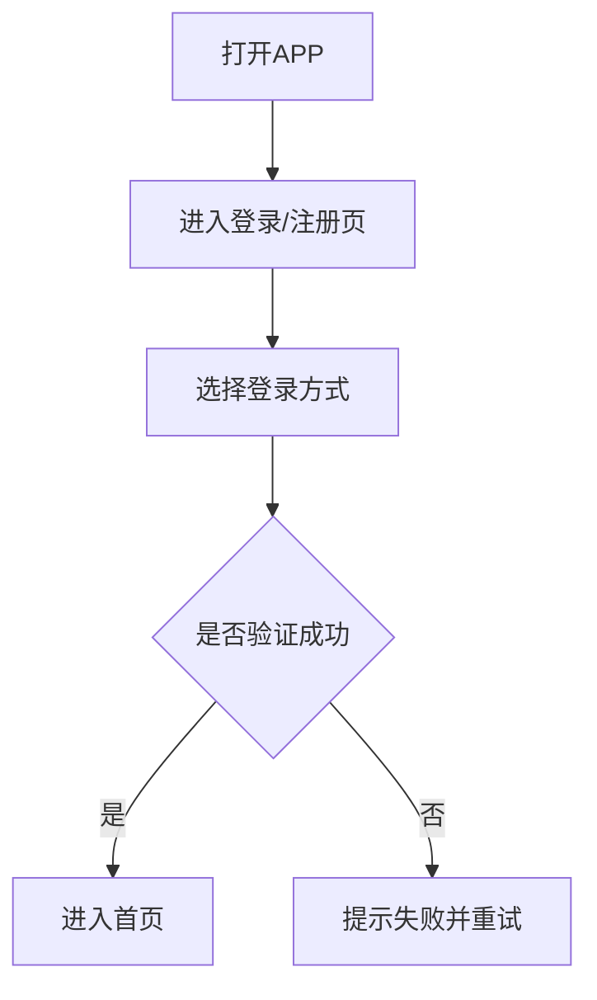
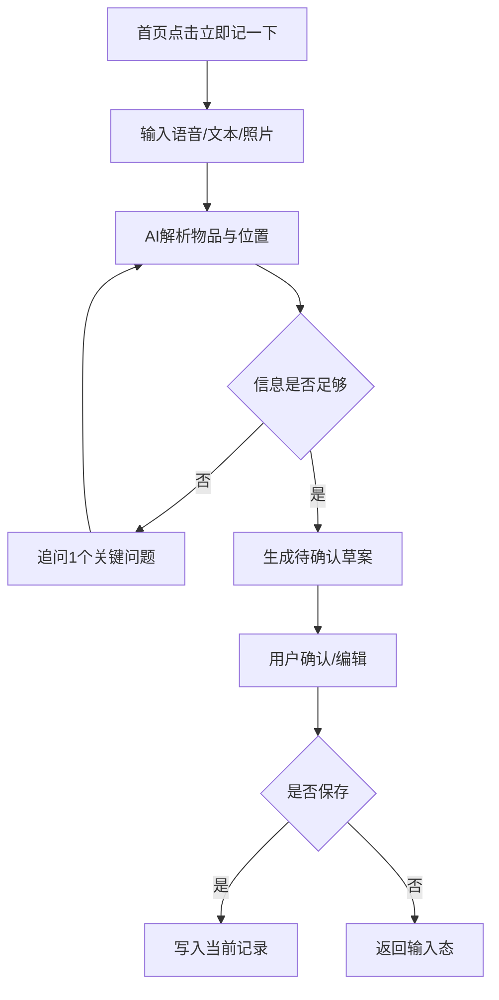
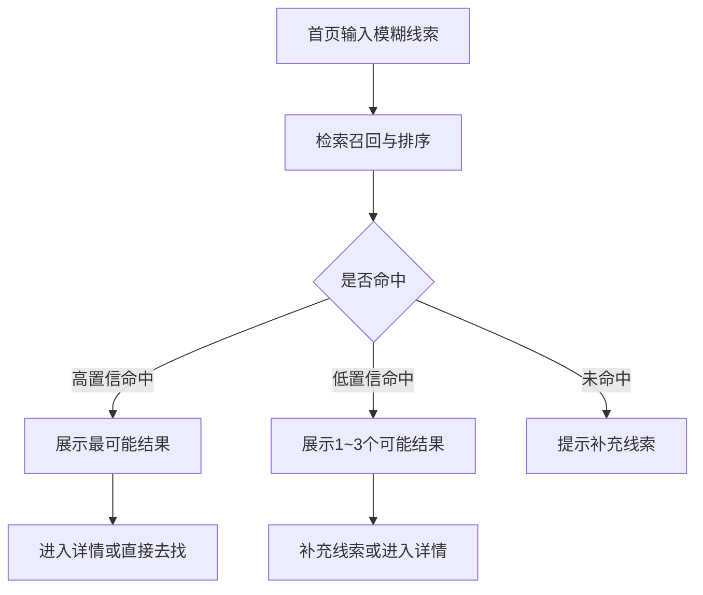
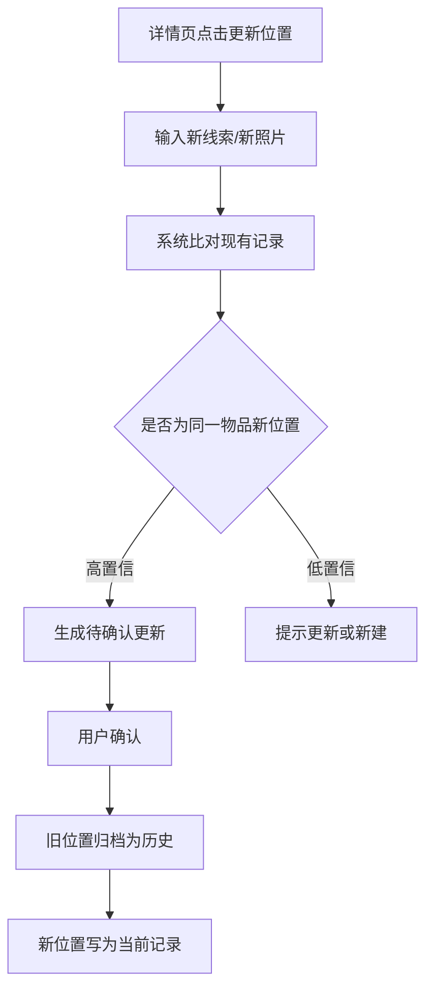
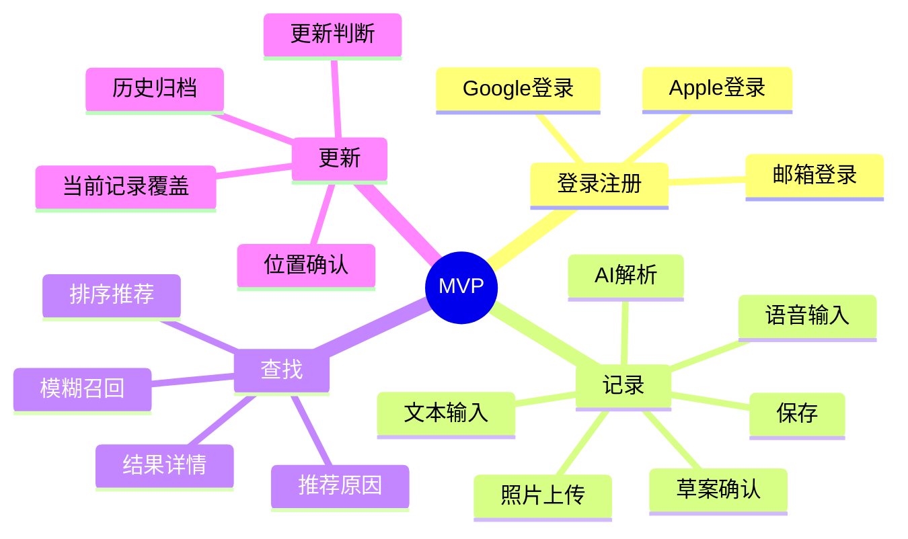

# 物品位置记忆 APP MVP PRD

## 1. 文档目标

基于《产品设计说明书》与《技术选型说明书》，明确 MVP 版本仅交付 4 个核心功能：登录/注册、记录、查找、更新，并补齐可直接用于开发和测试的业务逻辑说明。

## 2. 产品概述

这是一款 AI-first 的“物品位置记忆助手”。MVP 目标不是做完整收纳系统，而是先验证用户是否愿意用它完成“记下、找回、更新”这条最小闭环。

## 3. MVP 版本目标

- 用户能完成登录/注册并进入产品
- 用户能通过一句话或一张照片快速记录物品位置
- 用户能通过模糊线索快速查找物品
- 用户能在物品移动后快速更新当前位置并保留历史

## 4. MVP 范围

### 4.1 只做的 4 个核心功能

1. 登录 / 注册
2. 记录
3. 查找
4. 更新

### 4.2 包含在核心功能内的支撑能力

- 语音 / 文本输入
- 照片上传
- AI 结构化解析
- 位置标准化
- 当前记录展示
- 历史自动沉淀

说明：以上能力只作为 4 个核心功能的组成部分存在，不单独作为 MVP 功能域。

### 4.3 暂不纳入 MVP

- 家庭空间共享
- 敏感物品隐私控制体系
- 复杂权限管理
- 全自动无确认写入 / 更新
- 高精度品牌 / 型号级视觉识别
- 智能家居联动、3D 空间视图、整理建议

## 5. 核心业务对象与状态

### 5.1 核心业务对象

- **用户**：登录身份主体
- **物品**：名称、别名、分类、标签
- **位置**：房间、家具、分区、原始位置描述
- **当前记录**：当前有效位置、创建时间、更新时间
- **位置历史**：旧位置、新位置、更新时间、触发方式

### 5.2 关键状态

#### 账户状态

- `未登录`
- `登录中`
- `已登录`

#### 记录状态

- `输入中`
- `AI 解析中`
- `待确认草案`
- `已保存当前记录`

#### 搜索状态

- `输入线索`
- `召回中`
- `有结果`
- `低置信结果`
- `未命中`

#### 更新状态

- `待确认更新`
- `已更新当前位置`
- `已归档历史`

## 6. 功能需求与业务逻辑

### 6.1 登录 / 注册

#### 功能目标

让用户完成身份建立并进入产品首页。

#### 操作路径

启动 APP → 登录 / 注册页 → 选择登录方式 → 完成身份验证 → 进入首页。

#### 交互规则

- 支持邮箱、Apple、Google 登录。
- 登录与注册尽量合并为单路径，减少选择成本。
- 用户首次登录成功后直接进入首页，不要求在 MVP 中额外配置空间、权限或复杂资料。

#### 异常情况

- 登录失败：提示失败原因并支持重试。
- 第三方登录取消：返回登录页，保留原选择状态。
- 网络异常：提示网络不可用，不进入首页。

#### 状态转换

- `未登录` → `登录中` → `已登录`
- 失败时回到 `未登录`

### 6.2 记录

#### 功能目标

让用户在放下物品当下，用最少操作完成位置记录。

#### 操作路径

首页点击“立即记一下” → 输入语音 / 文本，可选上传照片 → AI 解析 → 生成草案 → 用户确认 → 保存成功。

#### 输入规则

- 至少提供一种输入：语音、文本、照片。
- 若只有照片且 AI 无法识别出有效物品或位置，必须要求用户补一句文字或语音。
- 用户原始输入必须保留，用于后续搜索和纠错。

#### 交互规则

- 首页主操作只有“立即记一下”。
- AI 自动提取物品名、位置、标签、视觉摘要等结构化信息。
- 位置标准化属于记录流程内部能力，用户只需要确认结果，不需要手填完整表单。
- AI 低置信度时，只允许追问一个最关键缺失项。
- 确认页至少展示：物品名、当前位置、照片/视觉摘要。

#### 异常情况

- 语音转写失败：提示改用文本输入，不阻塞流程。
- 图片上传失败：允许仅按文本/语音继续。
- AI 无法生成可确认草案：提示“信息不足”，引导补充一句描述。
- 保存失败：保留当前草案，不清空用户输入，支持重试。

#### 状态转换

- `输入中` → `AI 解析中` → `待确认草案` → `已保存当前记录`
- 若用户放弃保存：`待确认草案` → `输入中`

#### 验收重点

- 用户完成一次记录的核心动作应是“输入 + 确认”，而不是填写表单。
- AI 不确定结果不能直接成为正式记录。

### 6.3 查找

#### 功能目标

让用户只凭模糊线索也能尽快看到最可能答案。

#### 操作路径

首页搜索框输入线索 → 系统召回并排序 → 展示结果 → 用户进入详情或直接前往对应位置查找。

#### 搜索规则

- 支持物品名、别名、位置关键词、时间线索、照片视觉摘要、历史移动信息综合召回。
- 默认返回最可能的 1~3 条结果。
- 每条结果必须展示：物品名、当前位置、最近更新时间、推荐原因。
- 若有高置信单结果，可置顶展示“最可能在这里”。

#### 交互规则

- 用户不需要先选择分类或筛选条件。
- 结果页支持继续补充线索，触发二次搜索。
- 物品详情页展示当前位置、位置照片/视觉摘要、更新时间，并提供“更新位置”主操作。

#### 异常情况

- 无结果：提示补充线索，并展示最近记录辅助入口。
- 结果低置信：明确提示“以下为可能结果”，避免确定性表述。
- 搜索超时：提示稍后重试，并保留本次搜索词。

#### 状态转换

- `输入线索` → `召回中` → `有结果 / 低置信结果 / 未命中`

#### 验收重点

- 搜索结果要直接回答“最可能在哪”，而不是只返回关键词匹配列表。
- 推荐原因必须可读。

### 6.4 更新

#### 功能目标

让“更新位置”比“重新创建记录”更快，并自动保留历史。

#### 操作路径

从详情页点击“更新位置” → 输入一句话或上传新照片 → 系统判断是更新还是新建 → 用户确认 → 保存新位置。

#### 更新规则

- 系统必须先比对现有记录，判断是否是同一物品的新位置。
- 高置信度时，展示“是否将 X 从 A 更新到 B”。
- 低置信度时，不得直接覆盖旧记录；允许用户选择“确认为更新”或“另存为新记录”。
- 更新成功后，旧位置自动转入历史，不要求用户手动维护。
- 当前记录始终只保留一个有效当前位置。

#### 异常情况

- 新位置与当前位置相同：提示“位置未变化”，不新增历史。
- 更新失败：保持旧当前位置不变，草案保留待重试。
- 目标记录不存在：提示记录失效并返回搜索结果或首页。

#### 状态转换

- `已保存当前记录` → `待确认更新` → `已更新当前位置 + 已归档历史`
- 若选择另存新记录：`待确认更新` → `待确认草案`

#### 验收重点

- 更新链路的核心动作必须是“确认变化”，而不是重新填写完整记录。

## 7. 业务流程图

### 7.1 登录 / 注册流程

### 7.2 记录流程

### 7.3 查找流程

### 7.4 更新流程

## 8. 功能结构图

## 9. 非功能要求

- AI 输出必须以“可确认结果”为准，不允许低置信结果自动落库。
- 登录态必须安全可靠，服务端鉴权通过后才能访问记录数据。
- 搜索结果需要给出可读的推荐原因，避免纯黑盒输出。

## 10. 关键指标

- 登录 / 注册完成率
- 单次记录完成率
- 单次记录平均耗时
- 自然语言搜索命中率
- 搜索后直接找到物品的成功率
- 位置更新确认率

## 11. 版本结论

MVP 只验证最小闭环是否成立：用户愿不愿意登录、记下、找回、再更新。除此之外的共享、隐私增强和复杂权限都放到后续版本。
