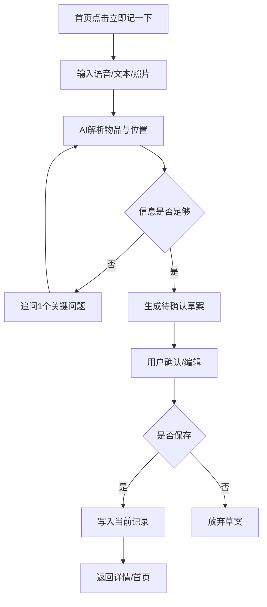
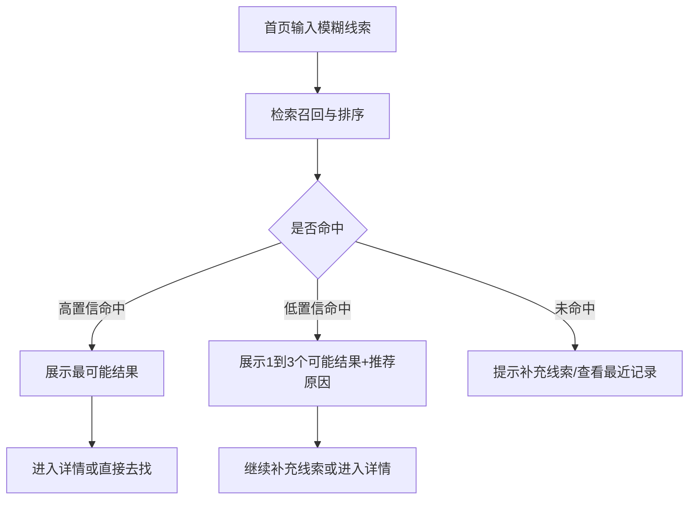
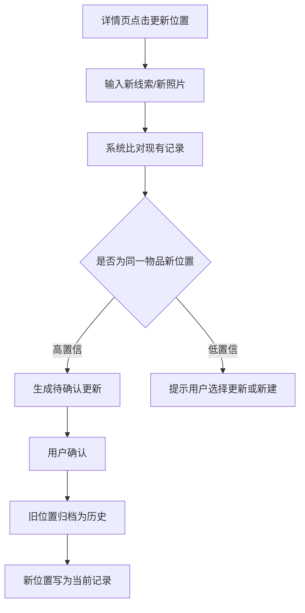
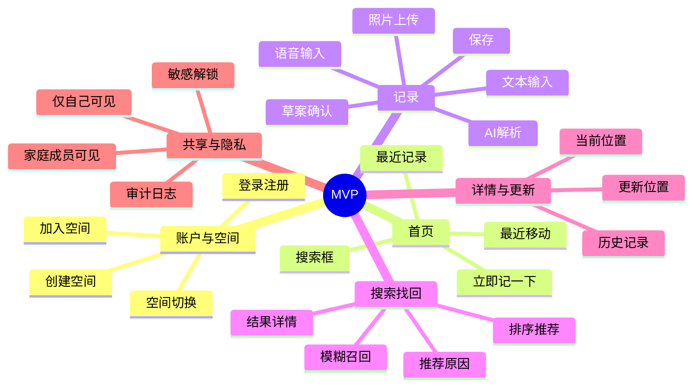

# 物品位置记忆 APP MVP PRD

## 1. 文档目标

基于《产品设计说明书》与《技术选型说明书》，定义 MVP 版本的产品范围、功能需求、业务逻辑和关键流程，供设计、开发、测试直接落地。

## 2. 产品概述

这是一款 AI-first 的“物品位置记忆助手”。核心目标是让用户以最低操作成本完成记录、找回和更新，并在多人共用空间中保持信息同步。

## 3. MVP 版本目标

- 让用户可以通过一句话、一次拍照完成物品位置记录
- 让用户可以通过模糊线索快速找回物品
- 让系统可以在物品移动后低成本更新当前位置并沉淀历史
- 让家庭空间内的基础共享与敏感信息保护可用

## 4. MVP 范围

### 4.1 必做范围

- 登录 / 注册
- 家庭空间创建、加入、切换
- 语音 / 文本一句话记录
- 照片上传与图片辅助理解
- AI 结构化解析与位置标准化
- 记录确认后保存
- 自然语言搜索与模糊线索召回
- 物品详情、当前位置、推荐原因展示
- 位置更新与历史自动归档
- 最近更新时间、最近更新人展示
- 记录可见范围控制（仅自己可见 / 家庭成员可见）
- 敏感物品隐藏精确位置 + 二次解锁查看

### 4.2 暂不纳入 MVP

- 全自动无确认写入 / 更新
- 指定成员可见等复杂权限
- 高精度品牌 / 型号级视觉识别
- 智能家居联动、3D 空间视图、整理建议

## 5. 目标用户与核心场景

面向经常忘记物品位置、家庭储物结构复杂、多人共用空间的用户。高频场景包括证件/药品/钥匙收纳、搬家换季后查找、家人帮忙整理后的找回。

## 6. 核心业务对象与状态

### 6.1 核心对象

- **家庭空间**：记录共享边界
- **物品**：名称、别名、分类、敏感等级
- **位置**：房间、家具、分区、位置别名、视觉摘要
- **当前记录**：当前有效位置、创建/更新时间、创建/更新人、可见范围
- **位置历史**：旧位置、新位置、更新时间、更新人、触发原因

### 6.2 关键状态

#### 记录状态

- `待确认草案`：AI 已生成结构化结果，但用户未确认
- `已保存当前记录`：用户确认后成为有效当前位置
- `待确认更新`：系统判断可能是已有物品的新位置，等待用户确认
- `已归档历史`：旧位置被更新后转入历史

#### 搜索状态

- `有结果`：返回 1~3 条高相关结果
- `低置信结果`：有候选，但需要用户补充线索或人工确认
- `未命中`：无足够结果，进入补充线索 / 引导记录

#### 敏感记录展示状态

- `模糊展示`：默认仅显示物品名和模糊位置
- `已解锁`：用户通过二次确认后显示精确位置和图片

## 7. 功能需求与业务逻辑

## 7.1 登录与家庭空间

### 功能目标

完成用户身份建立，并绑定到个人或家庭共享空间。

### 操作路径

启动 APP → 登录 / 注册 → 首次进入创建家庭空间或加入已有空间 → 进入首页。

### 交互规则

- 支持邮箱、Apple、Google 登录。
- 首次登录用户必须完成“创建空间”或“加入空间”二选一，未完成前不能进入首页主功能。
- 用户至少属于一个空间；若属于多个空间，可在首页切换当前空间。

### 异常情况

- 登录失败：提示失败原因并支持重试。
- 邀请码无效/过期：提示失效并返回加入空间页。
- 当前无可用空间：停留在空间引导页，不展示记录数据。

### 状态转换

- `未登录` → `已登录未入空间` → `已进入空间`
- 切换空间后，首页、搜索、记录列表全部刷新为当前空间数据

## 7.2 首页与全局入口

### 功能目标

首页只承载两类高频动作：**立即记一下**、**搜索找回**。

### 操作路径

进入首页 → 顶部搜索框 / 中部主按钮 / 最近记录入口。

### 交互规则

- 顶部固定搜索框，支持自然语言输入。
- 页面主按钮固定为“立即记一下”，点击后进入记录页。
- 首页展示最近记录、最近移动记录，便于二次更新。
- 当前空间名称需在首页可见并可切换。

### 异常情况

- 无网络：展示离线提示，不允许提交需要 AI 处理的新记录与搜索。
- 无最近记录：展示空态，引导用户先记录第一件物品。

## 7.3 AI 记录物品位置

### 功能目标

让用户在放下物品当下，通过最少输入完成记录。

### 操作路径

首页点击“立即记一下” → 输入语音/文本，可选上传照片 → AI 生成草案 → 用户确认 → 保存成功。

### 输入规则

- 至少提供一种输入：语音、文本、照片。
- 若只有照片且 AI 无法识别出有效物品或位置，必须要求用户补一句文字或语音。
- 用户原始输入必须保留，用于后续搜索和纠错。

### AI 解析规则

- 系统需从输入中提取：物品名、房间、家具、分区、位置别名、标签、视觉摘要。
- AI 输出的是“草案”，不是正式记录。
- AI 低置信度时，只允许追问一个最关键缺失项，例如“是主卧衣柜还是次卧衣柜？”。
- 若位置可标准化，则展示标准位置 + 原始表达；用户确认后写入标准位置。

### 确认页交互规则

- 确认页至少展示：物品名、当前位置、照片、敏感等级、可见范围。
- 用户可编辑 AI 结果后再保存。
- 敏感物品默认识别后需高亮提示，并默认采用更严格可见范围。
- 保存按钮点击后，成功前不可重复提交。

### 异常情况

- 语音转写失败：提示改用文本输入，不阻塞流程。
- 图片上传失败：允许仅按文本/语音继续。
- AI 无法生成可确认草案：提示“信息不足”，引导补充一句描述。
- 保存失败：保留当前草案，不清空用户输入，支持重试。

### 状态转换

- `输入中` → `AI 解析中` → `待确认草案` → `已保存当前记录`
- 若用户取消保存：`待确认草案` → `已放弃`

### 验收重点

- 用户完成一次记录的核心动作应是“输入 + 确认”，而不是填写表单。
- 任何 AI 不确定结果都不能直接成为正式记录。

## 7.4 位置标准化与别名管理

### 功能目标

解决同一位置多种说法的问题，支撑搜索、共享、更新一致性。

### 操作路径

记录保存时自动触发 → 系统生成标准位置与候选别名 → 用户确认后入库。

### 业务规则

- 标准位置层级最少支持：房间 > 家具 > 分区。
- 用户原始说法保留为位置别名或原始描述，不丢弃。
- 同一空间内，系统优先复用已有标准位置，减少重复创建。
- 家庭成员使用不同叫法时，搜索时都应能命中同一标准位置。

### 异常情况

- 无法归一到标准位置：允许先保存为低精度位置，但必须保留原始描述。
- 存在多个相似标准位置：要求用户确认，不自动合并。

### 状态转换

- `原始描述` → `标准化候选` → `已确认标准位置`

## 7.5 自然语言搜索与模糊找回

### 功能目标

用户只凭模糊线索，也能优先得到最可能答案。

### 操作路径

首页搜索框输入线索 → AI + 检索返回结果列表 → 查看结果 / 继续补充线索。

### 搜索规则

- 支持按物品名、别名、位置关键词、时间线索、视觉线索、历史移动信息综合召回。
- 默认只返回最可能的 1~3 条结果。
- 每条结果必须展示：物品名、当前位置、位置照片或视觉摘要、最近更新时间、最近更新人、推荐原因。
- 若结果为敏感物品，列表页只显示模糊位置。

### 交互规则

- 用户不需要先选择分类或筛选条件。
- 若有高置信单结果，可置顶展示“最可能在这里”。
- 用户可在结果页继续追加线索，触发二次搜索。

### 异常情况

- 无结果：提示补充线索，并展示“最近记录/最近移动”辅助入口。
- 结果低置信：明确提示“以下为可能结果”，不使用确定性文案。
- 搜索服务超时：提示稍后重试，并保留本次搜索词。

### 状态转换

- `输入线索` → `召回中` → `有结果 / 低置信结果 / 未命中`

### 验收重点

- 搜索页输出应直接回答“最可能在哪”，而不是只返回关键词匹配列表。
- 推荐原因必须可读，减少黑盒感。

## 7.6 物品详情与当前位置展示

### 功能目标

在单个物品页承接“确认当前位置、查看历史、继续更新”。

### 操作路径

搜索结果 / 最近记录进入详情页。

### 展示规则

- 默认展示：物品名、当前位置、位置照片/视觉摘要、最近更新时间、最近更新人、标签。
- 若为敏感物品，默认展示模糊位置；解锁后才展示精确位置和图片。
- 详情页仅保留一个主操作：“更新位置”。

### 异常情况

- 记录已被删除或无权限：提示不可访问并返回上一页。

## 7.7 更新位置与历史自动沉淀

### 功能目标

让“更新位置”比“重新创建记录”更快，并自动保留历史。

### 操作路径

从详情页点击“更新位置” / 从最近记录快速更新 → 输入一句话或上传新照片 → 系统判断是更新还是新建 → 用户确认 → 保存新位置。

### 更新判断规则

- 系统必须先比对现有记录，判断是否是同一物品的新位置。
- 高置信度时，展示“是否将 X 从 A 更新到 B”。
- 低置信度时，不得直接覆盖旧记录；允许用户选择“确认为同一物品更新”或“另存为新记录”。

### 历史规则

- 更新成功后，旧位置自动转入历史，不要求用户手动维护。
- 历史记录至少保存：旧位置、新位置、更新时间、更新人、触发来源。
- 当前记录始终只保留一个有效当前位置。

### 异常情况

- 新位置与当前位置相同：提示“位置未变化”，不新增历史。
- 更新失败：保持旧当前位置不变，草案保留待重试。
- 多人同时更新：以后提交成功的一次为当前记录，同时保留冲突审计日志。

### 状态转换

- `已保存当前记录` → `待确认更新` → `已保存当前记录 + 已归档历史`
- 若选择另存新记录：`待确认更新` → `待确认草案`

### 验收重点

- 更新链路的核心动作必须是“确认变化”，而不是重新填写完整记录。

## 7.8 历史记录查看

### 功能目标

帮助用户理解“当前在哪、之前在哪、何时被谁改过”。

### 操作路径

物品详情页 → 历史记录。

### 交互规则

- 按时间倒序展示位置变更。
- 每条历史显示旧位置、新位置、更新时间、更新人。
- 敏感物品历史同样遵循模糊展示与解锁规则。

## 7.9 家庭空间共享

### 功能目标

在家庭空间内实现基础共享，让成员对同一物品位置形成统一认知。

### 操作路径

创建/加入空间后自动生效 → 记录、搜索、更新均默认在当前空间内进行。

### 业务规则

- 当前空间内成员可搜索和查看“家庭成员可见”的记录。
- “仅自己可见”的记录仅记录创建者本人可见。
- 所有共享记录必须显示最近更新人和更新时间。
- 不同成员对同一位置的不同叫法，应通过位置别名归一提高召回率。

### 异常情况

- 成员被移出空间：即时失去该空间记录访问权限。
- 用户切换空间：仅展示目标空间内数据，不混查。

## 7.10 敏感物品隐私保护

### 功能目标

在 MVP 阶段为证件、药品、贵重物品提供基础安全保护。

### 业务规则

- 护照、证件、药品、贵重物品默认识别为高敏感，也允许用户手动调整。
- 敏感记录在列表和搜索结果中默认仅展示模糊位置，如“主卧收纳区”。
- 查看精确位置前需二次确认，可使用生物识别或设备级验证。
- 敏感图片默认私有，不进入公共推荐流。
- 敏感记录的查看与更新需写审计日志。

### 异常情况

- 设备不支持生物识别：降级为设备密码或二次确认弹窗。
- 二次确认失败：保持模糊展示，不泄露精确位置。

### 状态转换

- `模糊展示` → `二次确认中` → `已解锁`
- 解锁失效后返回 `模糊展示`

## 8. 业务流程图

### 8.1 记录流程

### 8.2 搜索找回流程

### 8.3 更新流程

## 9. 功能结构图

## 10. 非功能要求

- AI 输出必须以“可确认结果”为准，不允许低置信结果自动落库。
- 敏感记录默认最小展示、存储私有、服务端权限校验全覆盖。
- 搜索结果需要有可解释推荐原因，避免纯黑盒输出。

## 11. 关键指标

- 核心指标：记录完成率、搜索命中率、更新确认率。
- 辅助指标：平均记录耗时、平均找回耗时、敏感记录解锁成功率。

## 12. 版本结论

MVP 只验证一件事：用户是否愿意把这款产品当作长期“家庭物品外部记忆系统”。因此一切设计都应优先服务记录更轻、找回更快、更新更省心，而不是追求复杂功能完备。
